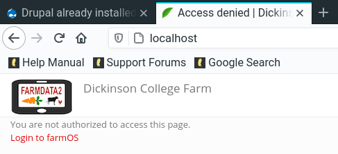

## Installing FarmData2 ##

This document provides a guide to installing the FarmData2 project.  There are separate sections for doing a developer install and a user install.  If you are interested in working on and contributing to the FarmData2 project follow the Developer Install section.  If you are interested in using the FarmData2 application follow the User Install section.

## Communications ##  

There is a dedicated [Install _stream_](https://farmdata2.zulipchat.com/#narrow/stream/270906-install) on the [FarmData2 Zulip chat](https://farmdata2.zulipchat.com). This is the place to ask and look for answers to your install related questions.

### User Install ###

FarmData2 is currently in the early stages of development and thus is not ready for independent use.  This section will be updated when FarmData2 has reached a state of development that is suitable for use.  In the meantime, please contact braught@dickinon.edu or allen@npfi.org for credentials if you would like to explore the trial instance available at [FarmData2 Trial](http://npfi.org/farmdata2/).  

### Developer Install ###

Before beginning this install please review the [CONTRIBUTING.md](CONTRIBUTING.md) document and in particular be sure to follow the links to the [CODE_OF_CONDUCT.md](CODE_OF_CONDUCT.md) that sets the expectations for the FarmData2 community.

#### Development Platform ####

We recommend Ubuntu Linux as the development platform for FarmData2.  It is the development platform used by the core team and thus is the most well understood and most fully tested. Users of Windows and MacOS should consider using Ubuntu Linux within [Virtual Box](https://www.virtualbox.org/) as their development platform.  That said, developers experienced with tools like git, docker and docker-compose should not face any substantial barriers to development directly on Windows, MacOS or other Linux flavors.

The following are some recommendations for setting up a development platform using Linux in VirtualBox:

  - The FOSS guide to [Install Linux Inside Windows Using VirtualBox](https://itsfoss.com/install-linux-in-virtualbox/) is a good place to start if you are unfamiliar with this process. This is a guide for Windows, but works equally well for MacOS with a little adaptation.
  - If your machine has 8GB or more of RAM [Ubuntu Desktop](https://ubuntu.com/download/desktop) is recommended with an allocation of at least 4GB of RAM to the virtual machine.
  - If your machine has less than 8GB of RAM Ubuntu based [Linux Lite](https://www.linuxliteos.com/) is recommended with an allocation of half of the machine's RAM to the virtual machine.
  - When creating your virtual machine:
    - Allocate a virtual disk of at least 30GB.
    - Set the Video Memory to 128 MB.
   - __MacOS:__ If you are running VirtualBox on MacOS using a machine with a retina display the performance can be quite sluggish. [Launching VirtualBox in Low Resolution Mode](https://forums.virtualbox.org/viewtopic.php?f=8&t=90446&start=75#p470879) will resolve this issue.

#### Prerequisites ####

FarmData2 relies on a few prerequisite programs that will need to be installed on your development platform. You will need to install
  * git
  * docker
  * docker-compose

Under Ubuntu Linux these tools can most easily be installed using the [apt](https://wiki.debian.org/AptCLI) or [synaptic](https://wiki.debian.org/Synaptic) package managers.  You might read the It's FOSS Complete guide to [Using apt Commands in Linux](https://itsfoss.com/apt-command-guide/) if you are unfamiliar with apt.

Full installation details for other platforms can be obtained from the projects themselves on the following sites:

  * [Intallling git](https://git-scm.com/book/en/v2/Getting-Started-Installing-Git)
  * [Get Docker](https://docs.docker.com/get-docker/)
  * [Install Compose](https://docs.docker.com/compose/install/)

#### Linux Docker Configuration ####

If you are developing under Linux you will need to be able to [Manage Docker as a non-root user](https://docs.docker.com/engine/install/linux-postinstall/#manage-docker-as-a-non-root-user).  To do so you need to add your user to the `docker` group. Use the following commands:
```
sudo groupadd docker
sudo usermod -aG docker $USER
```

Then log out and back into the system. When you log back in your user will have the permissions needed in order to use docker commands.  Note that if you are developing on a virtual machine you will need to restart the virtual machine for the changes to take effect.

#### Getting FarmData2 ####

FarmData2 is hosted in a GitHub repository that can be found here:

  * [FarmData2 GitHub Repository](https://github.com/DickinsonCollege/FarmData2)

To get started:

  1. [Create a GitHub Account](https://github.com/join) (if you do not already have one).
     - To access GitHub via the command line git tools you will need to [Create a personal access token](https://docs.github.com/en/github/authenticating-to-github/keeping-your-account-and-data-secure/creating-a-personal-access-token) in GitHub.
     - You will also probably want to [Store your GitHub Credentials with the Git Credential Helper](https://techexpertise.medium.com/storing-git-credentials-with-git-credential-helper-33d22a6b5ce7) to avoid retyping the token for every operation.
  1. [Fork the FarmData2 repository](https://docs.github.com/en/free-pro-team@latest/github/getting-started-with-github/fork-a-repo) into your own GitHub account.
  1. [Clone your fork](https://docs.github.com/en/free-pro-team@latest/github/creating-cloning-and-archiving-repositories/cloning-a-repository) of FarmData2 to your development machine.
  1. [Set your upstream remote](https://docs.github.com/en/free-pro-team@latest/github/collaborating-with-issues-and-pull-requests/configuring-a-remote-for-a-fork) to point to the main [FarmData2 repository](https://github.com/DickinsonCollege/FarmData2) at https://github.com/DickinsonCollege/FarmData2.

#### Install the Sample Database Image ####

The FarmData2 repository contains a sample database with anonymized data from several years of operation of the [Dickinson College Farm](https://www.dickinson.edu/farm). This database is in the compressed file `docker/db.sample.tar.bz2` and needs to be expanded before it can be used.  Change into the `docker` directory in the repository and use the command below:
```
./setDB.bash sample
```

When this command completes there should be a `db` directory in the `docker` directory.  The files in this `db` directory are a mySQL database that contain the sample data.  Note that you will only need to do this step once. But the above comman can be used at any time to reset the database to its initial state.

#### Starting FarmData2 ####

To start FarmData2 ensure that you are in the `docker` directory in the repository and use the command below:
```
./fd2-up.bash
```

This command will start up the docker containers that are used by FarmData2. There will be lots of output from this command and the first time you run it, it may take a while to complete as it pulls, downloads and extracts the docker images to your machine.

If you encounter an error similar to `Cannot start service www`, it can likely be fixed by entering the command
```
sudo service apache2 stop
```

That's it! You now have a running version of FarmData2 that is loaded with the sample data set and is suitable for development work.

#### Logging Into FarmData2 ####

Open a browser and go to:
```
http://localhost
```
If everything has worked you will see the FarmData2 login screen.



  1. Click on "Login to farmOS"
  1. Log in using one of the following credentials:
     * Administrator:
       * Username: `admin`
       * Password: `farmdata2`
     * Farm Managers:
       * Username: `manager1` (or `2`)
       * Password: `farmdata2`
     * Farm Workers:
       * Username: `worker1` (or `2`, `3`, `4`)
       * Password: `farmdata2`
     * Guest:
       * Username: `guest`
       * Password: `farmdata2`

#### Editing Code & Documentation ####

The code and documentation can be edited with any editor.  For convenience, the FarmData2 installation includes a browser-based integrated development environment (IDE). To use this IDE open a browser tab and go to:
```
http://localhost:3000
```
When the IDE opens:
  1. Click "Open Workspace"
  1. Select the `FarmData2` directory
  1. Click "Open"

The explorer on the left will show the contents and structure of the FarmData2 repository. More information about getting started working on the FarmData2 code and documentation can be found in the [CONTRIBUTING](CONTRIBUTING.md) document.

#### Stopping and Starting FarmData2 ####

The above process of installing FarmData2 only needs to be completed once.  Now you will need only to start and stop the docker containers before and after each work session.

From the `docker` directory in the repository you can:

  * Stop FarmData2:
  ```
  ./fd2-down.bash
  ```

  * Start FarmData2:
  ```
  ./fd2-up.bash
  ```

#### A Note on Persistence ####

The `fd2-up.bash` and `fd2-down.bash` scripts use `docker-compose` to start all of the FarmData2 containers.  When `./fd2-down.bash` is run `docker-compose` removes all of the containers, including their writeable layers.  The containers are all recreated, including blank writeable layers, each time the `fd2-up.bash` is used. However, all of the FarmData2 data and code is mounted from the development machine and thus will persist between uses. You can find all of the details of the mounted volumes in the `docker-compose.yml` file.

The FarmData2 database, that we expanded earlier, is mounted into the container from the directory:
  * `docker/db`

The FarmData2 code is mounted into the container from the directories:
  * `contrib_modules`
  * `farmdata2_modules`

Changes to the code in these directories on the development machine will be reflected by the instance of FarmData2 running in the container.

#### Availability of phpMyAdmin ####

For developers working on back-end services and the FarmData2 data model the installation starts a phpMyAdmin service that is available at `localhost:8181`.  You can connect to this service as an administrator using the credentials:
  * Username: `root`
  * Password: `farm`
