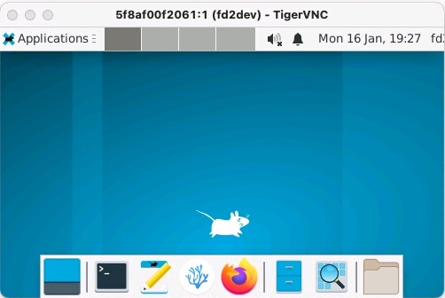

# Installing FarmData2 #

This document provides a guide to installing the FarmData2 project. There are separate sections for doing a developer install and a user install. If you are interested in working on and contributing to the FarmData2 project, follow the Developer Install section. If you are interested in using the FarmData2 application follow the User Install section.

## Communications ##  

There is a dedicated [Install _stream_](https://farmdata2.zulipchat.com/#narrow/stream/270906-install) on the [FarmData2 Zulip chat](https://farmdata2.zulipchat.com). This is the place to ask and look for answers to your install related questions.

## User Install ##

FarmData2 is currently in the early stages of development and thus is not ready for production use. This section will be updated when FarmData2 has reached a state of development that is suitable for use in the field.

## Developer Install ##

Before beginning this install please review the [Code of Conduct](CODE_OF_CONDUCT.md) that sets the expectations for the FarmData2 community and the [License Information](LICENSE.md) that describes FarmData2's licensing.

### Prerequisites ###

FarmData2 relies on a few prerequisites that will need to be installed on your computer. You will need to install:
  - git
  - docker Desktop
  - TigerVNC Viewer

Full installation details for these tools are provided by the projects themselves as described and linked below:

  - [Install git](https://git-scm.com/book/en/v2/Getting-Started-Installing-Git)
    - Test your install using the command: `git --version`
  - Installing Docker Desktop
    - Installation
      - For Windows:
        - First [install *WSL* (the *Windows Subsystem for Linux*)](https://learn.microsoft.com/en-us/windows/wsl/install).
        - Test that you can *Open an WSL Terminal* by:
          - Open a PowerShell
          - Use the command `wsl`
            - The command prompt should change to a Linux prompt instead of a PowerShell prompt.
          - You'll be using a *WSL Terminal* for many of the steps below.
        - Then follow the instructions for installing [Docker Desktop for Windows](https://docs.docker.com/desktop/install/windows-install/). Be sure to follow the directions for the "WSL 2 backend" (not the "Hyper-V backend").
      - For MacOS:
        - Follow the instructions for installing [Docker Desktop for Mac](https://docs.docker.com/desktop/install/mac-install/). Be sure to choose "Mac with Intel Chip" or "Mac with Apple Silicon" as appropriate for your Mac.  If you are unsure, choose "About this Mac" from the Apple menu and check which "Chip" is in your Mac (Intel or Apple).
      - For Linux:
        - Follow the instructions for installing [Docker Desktop for Linux](https://docs.docker.com/desktop/install/linux-install/).
    - Test your installation of Docker Desktop.
      - Open a Terminal (**in Windows be sure to use a WSL Terminal**) and use the command: 
        ```
        docker run hello-world
        ```
        - You should be able to run this command without `root` or `admin` privileges.
        - If successful, this command will generate some output containing the following text indicating that it worked correctly:
          ```
          Hello from Docker!
          This message shows that your installation appears to be working correctly.
          ```
  - TigerVNC Viewer - Download and install the TigerVNC viewer for your host operating system (Windows, Mac or Linux):
    - Windows: [vncviewer64-1.12.0.exe](https://sourceforge.net/projects/tigervnc/files/stable/1.12.0/vncviewer64-1.12.0.exe/download)
    - MacOS: [TigerVNC-1.12.0.dmg](https://sourceforge.net/projects/tigervnc/files/stable/1.12.0/TigerVNC-1.12.0.dmg/download)
    - Linux: [tigervnc-1.12.0.x86_64.tar.gz](https://sourceforge.net/projects/tigervnc/files/stable/1.12.0/tigervnc-1.12.0.x86_64.tar.gz/download)

### Getting FarmData2 ###

FarmData2 is hosted in a GitHub repository that can be found here:

  * [FarmData2 GitHub Repository](https://github.com/DickinsonCollege/FarmData2)

To get started:

  1. [Create a GitHub account](https://github.com/join) (if you do not already have one).
  1. [Fork the FarmData2 repository](https://docs.github.com/en/free-pro-team@latest/github/getting-started-with-github/fork-a-repo) into your own GitHub account.
  1. Open a Terminal (**in Windows be sure to use a WSL Terminal**), then:
     1. [Clone your fork](https://docs.github.com/en/free-pro-team@latest/github/creating-cloning-and-archiving-repositories/cloning-a-repository) of FarmData2.
     1. Change your directory to where you have cloned FarmData2 using `cd`.
     1. [Set your upstream remote](https://docs.github.com/en/free-pro-team@latest/github/collaborating-with-issues-and-pull-requests/configuring-a-remote-for-a-fork) to point to the main [FarmData2 repository](https://github.com/DickinsonCollege/FarmData2) at https://github.com/DickinsonCollege/FarmData2.

### Starting FarmData2 ###

To start FarmData2 
1. Ensure that Docker Desktop is running on your machine.   
1. In a Terminal (**in Windows be sure to use a WSL Terminal**):
   1. Change to the `docker` directory of the FarmData2 repository. 
   1. Use the command:
      ```
      ./fd2-up.bash
      ```
      This command will start up the Docker containers that are used by FarmData2. The first time you run this command, there will be lots of output, and it may take a while to complete as it pulls and extracts the necessary docker images to your machine. Be patient, this may take as long as 10-15 minutes depending upon your machine and your internet connection. 
      
      You will know the command is complete when the following output appears:
      ```
      FarmData2 started.
      ```

### Connecting to the FarmData2 Development Environment ###

FarmData2 provides a full featured Debian Linux-based development environment. This development environment is automatically running inside one of the Docker containers that was started by the `./fd2-up.bash` script.

**All of the FarmData2 instructions and documentation assume that you are working within this FarmData2 development environment.** 

That said, developers experienced with tools like git, docker and docker-compose should not face any substantial barriers to development directly on Windows, MacOS, or other Linux flavors. There are however a few exceptions where the development environment is required and those are noted in the appropriate places.

#### Connecting via TigerVNC Viewer ####

You can connect to the FarmData2 development environment using the TigerVNC Viewer as follows:
1. Run your TigerVNC Viewer.
2. Set the "VNC Server" field to: `localhost:5901`.
3. Click "Connect".
4. If nothing happens and the TigerVNC Viewer quits, wait a moment and try again. It typically takes a few moments for the VNC server in the container to start.

When the TigerVNC Viewer connects to the FarmData2 development environment, a window like the one below will open displaying the desktop of the Debian Linux system that is running in the docker container.



#### Connecting via a Browser ####

You can also connect to the FarmData2 development environment using a noVNC client through a web browser. 
1. Open a web browser on the host OS.
2. Visit the URL: `localhost:6901`.
3. Click "Connect".
4. Use the NoVNC settings (on the left) to set the "Scaling Mode" to "Remote Resizing".

Note: When accessing the development environment via the browser, copying and pasting between the host OS and the development environment using the noVNC clipboard is tedious. However, if you work entirely inside the development environment, it is quite functional.

When the noVNC client connects to the FarmData2 development environment the desktop of the Debian Linux system that is running in the docker container will appear in your browser window.

#### Development Environment Credentials ####

Your user credentials within the FarmData2 Development environment are:
* Username: `fd2dev`
* Password: `fd2dev`

The only time you are likely to need these credentials is if you use the `sudo` command.

### Configure `git` in the Development Environment ###

Configure the git CLI within the FarmData2 development environment by:
1. Open a Terminal.
2. `git config --global user.email "you@your.email"`
3. `git config --global user.name "your github username"`
4. [Create a personal access token](https://docs.github.com/en/github/authenticating-to-github/keeping-your-account-and-data-secure/creating-a-personal-access-token) in GitHub, if you don't have one already.
   * Set the "Expiration" to a reasonable duration.
   * Select the "repo" scope when creating the token.
   * Copy the token to the clipboard.
5. `cd FarmData2`
6. `git push origin main`
   * Enter your GitHub username.
   * Paste in your personal access token.

Note: The git client in the FarmData2 development environment is set to "store" your git credentials. This makes it so you do not have to re-enter your username and personal access token every time you `push`. The "store" option saves your GitHub password in plain text in your account. This is generally safe if you are using your own computer within a password protected account. The [Store your GitHub Credentials with the Git Credential Helper](https://techexpertise.medium.com/storing-git-credentials-with-git-credential-helper-33d22a6b5ce7) page gives more information about the "store" option and other more secure options for how to manage your git credentials.

### Install the Sample Database Image ###

The FarmData2 repository contains a sample database with anonymized data from several years of operation of the [Dickinson College Farm](https://www.dickinson.edu/farm). This database is in the compressed file `docker/db.sample.tar.bz2` and needs to be expanded before it can be used. To install the sample database image:
1. Open a Terminal.
2. `cd FarmData2/docker`
3. `./setDB.bash sample`

When this command completes there should be a `db` directory in the `docker` directory. The files in this `db` directory are a mySQL database that contain the sample data. Note that you will only need to do this step once. But the above command can be used at any time to reset the database to its initial state.

### Logging Into FarmData2 ###

Open a browser within the FarmData2 development environment and go to:
```
http://fd2_farmdata2
```
If everything has worked, you will see the FarmData2 login screen.


  1. Click on "Login to farmOS".
  1. Log in using one of the following credentials:
     * Administrator:
       * Username: `admin`
       * Password: `farmdata2`
     * Farm Managers:
       * Username: `manager1` (or `2`)
       * Password: `farmdata2`
     * Farm Workers:
       * Username: `worker1` (or `2`, `3`, `4`)
       * Password: `farmdata2`
     * Guest:
       * Username: `guest`
       * Password: `farmdata2`

Note: You can also connect to the running FarmData2 instance from a browser in your host OS (e.g. MacOS, Windows, Linux) using the URL:
```
http://localhost
```

### Editing Code and Documentation ###

The FarmData2 developer environment includes the VSCodium IDE.  This IDE is pre-configured with all of the extensions necessary for FarmData2 development. You can open this IDE and the FarmData2 project by:
1. Clicking the VSCodium icon dock at the bottom of the desktop.
2. Choosing "Open Folder" from the "File" menu.
3. Selecting "FarmData2".
4. Clicking the "Open" button.
5. Confirm that you "trust the authors of the files in this folder," if asked.
6. Choose "Explorer" from the "View" menu to see the `FarmData2` file tree.

Note: You can also choose to use VSCode or VSCodium on your host machine (Mac, Windows, Linux) to edit the contents of the FarmData2 repository that you cloned.  The FarmData2 repository is mounted from your host machine into the development container. Thus, editing these files on the host machine is equivalent to editing them in the development container. If you are using VSCode or VSCodium on your host OS, you can refer to the [docker/dev/Dockerfile](docker/dev/Dockerfile) file for information about the VSCodium extensions that are being used by the FarmData2 development environment.

### Stopping and Starting FarmData2 ###

The above process of installing and setting up the FarmData2 development environment only needs to be completed once. Once it is completed, you will only need to start and stop the docker containers before and after each work session.

In a Terminal (a WSL Terminal on windows), change into the `docker` directory in the FarmData2 repository. From there you can:

  * Stop FarmData2:
  ```
  ./fd2-down.bash
  ```

  * Start FarmData2:
  ```
  ./fd2-up.bash
  ```

### What Next? ###

You now have a fully operational developer install of FarmData2 including the development environment. Check out the [CONTRIBUTING Document](CONTRIBUTING.md) for a step-by-step guide for how to make your first contribution to FarmData2. For other ways to contribute, you can check out the [Ways to Contribute Document](docs/WaysToContribute.md). The [RESOURCES Document](RESOURCES.md) provides a list of more detailed reference information about FarmData2.
