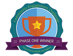
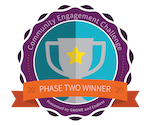

## FarmData2 ##

FarmData2 is an application that supports the operation and certification requirements for small organic farming operations.

### Description ###

FarmData2 is a web application for recording and reporting on crop and livestock production within the context of small organic farming operations.  Crop production records include seeding, transplanting, harvest, cover crop, compost, fertilization, irrigation, pest scouting, and spray activities.  Livestock production records track animals from birth to slaughter or sale and include pasture moves, periodic and veterinary care and logging of egg production.  Records of packing, distribution and customer invoicing are also maintained.  All records and reporting features are designed to closely align with organic certification requirements and to support the certification and recertification process.

### Installing FarmData2 ###

If you are interesting in trying or using FarmData2 see the [INSTALL Document](INSTALL.md) for information about how to get started.

### Contributing to FarmData2 ###

If you are interesting in contributing to the development of FarmData2 see the [CONTRIBUTING Document](CONTRIBUTING.md) for information about how to get started.

### Connecting ###

Connect with the [FarmData2 community on Zulip](https://farmdata2.zulipchat.com/).

If you are unfamiliar with [Zulip](https://zulip.com/) it is a group chat application that blends the benefits of threaded discussions with live chat. Zulip is relatively easy to use once you understand the key ideas of [streams and topics](https://zulip.com/help/about-streams-and-topics).

### History ###

FarmData2 is both a _second_ edition of it predecessor, FarmData, and the integration of _two_ related projects FarmData and AnimalData. These projects were conceived and built by Tim Wahls, Matt Steiman and many students to support operation of the Dickinson College Farm.  The FarmData2 project was initiated as a part of curricular redesign in the Computer Science Department at Dickinson College.  It is now an active part of several courses in the curriculum.  It provides students in these courses with early and sustained opportunities to learn and practice modern software development within the context of an open source software community.

### Acknowledgements ###

FarmData2 is powered by the farmOS open source project.

Support and assistance with FarmData2 development has been received from [The Non-Profit FOSS Institute](https://npfi.org/).

The development of FarmData2 has received partial support from:
* The GNOME Community Engagement Challenge:
  *     
* The National Science Foundation (DUE-2013069) - Collaborative Research: Broadening Participation in Computing through Authentic, Collaborative Engagement with Computing for the Greater Good.
* [Zulip](https://zulip.com) provides sponsored hosting for [FarmData2 community discussions](https://farmdata2.zulipchat.com/#narrow/stream/270883-general).

---

 All textual materials in the FarmData2 project are licensed under a [Creative Commons Attribution-ShareAlike 4.0 International License](http://creativecommons.org/licenses/by-sa/4.0/)

 All executable code in the FarmData2 project are licensed under the [GNU General Public License Version 3 or later](https://www.gnu.org/licenses/gpl.txt)
